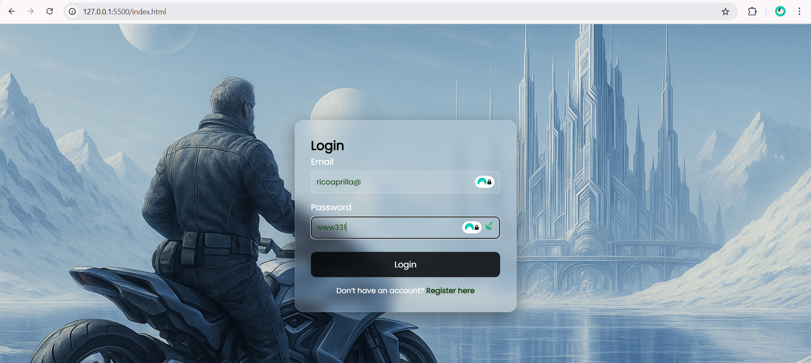
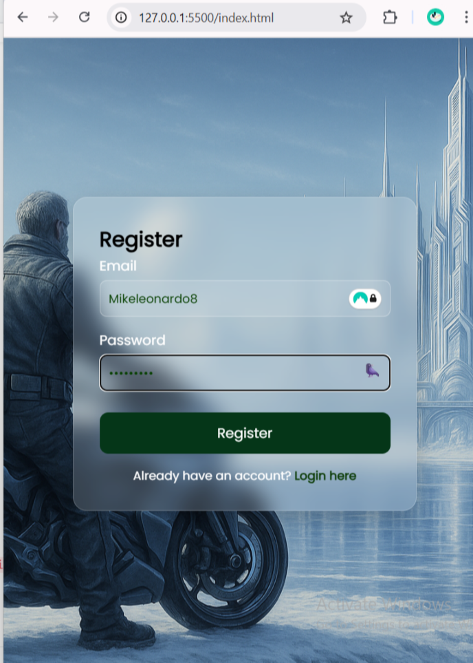

# Login-Register-Form V1

A futuristic Login & Register UI with pure HTML, CSS & Vanilla JS — powered by **Glassmorphism**, custom wallpaper, and a responsive layout.

## Live Demo
🔗 [Open Live Website](https://ricoaprillananda.github.io/Login-Register-Form-V1/)

---

## Features

- Glassmorphism login & register card
- Custom sci-fi wallpaper (stored in `/assets`)
- Fully responsive layout
- Password show/hide toggle (Vanilla JS)
- Styled with love using `Poppins` font

---

## Tech Stack

- HTML5
- CSS3 (Glassmorphism, Responsive Design)
- JavaScript (Vanilla)
- Hosted on: **GitHub Pages**

---

## Wallpaper Credits

Custom AI-generated background designed for futuristic arctic city atmosphere with a sci-fi motorbike character (non-copyrighted, free use).

---

 

## Next Version Ideas

- ✅ LocalStorage user save
- ✅ Email validation
- ✅ Firebase Auth integration
- ✅ Animated page transitions
- ✅ Dark mode toggle

---

💎 Designed & Engineered by

🍃 Rico Aprillananda
Frontend Engineer • UI/UX Futurist • Lightsaber Coder

🌑 Evelyn
Creative Director • System Architect • Mysterious Partner
"Her presence is unseen, but her signature glows in every detail."

## License

MIT — Feel free to use, fork, or modify 

